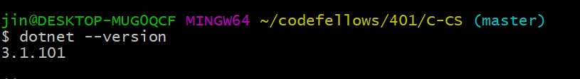
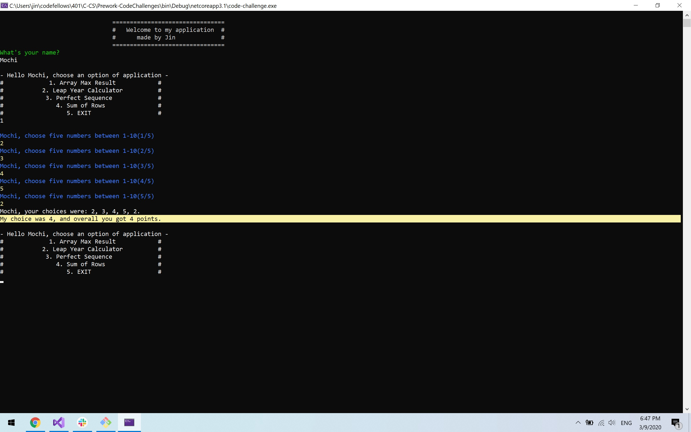
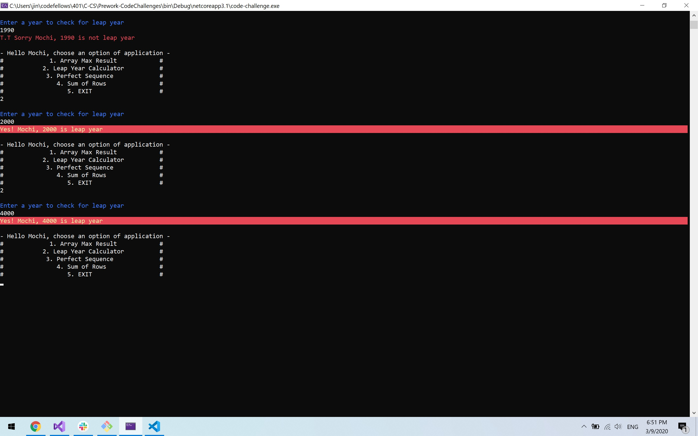
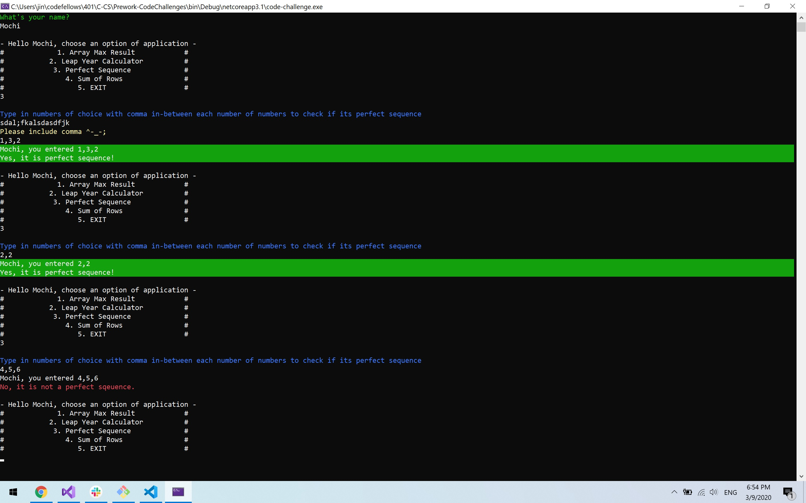
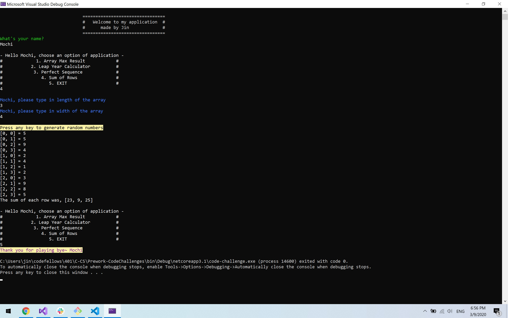

# .NET Prework
MIT based repository that contains Code Fellows 401 pre-work.

Author: Jin Kim

Prework  

## MindSet
- [Deliberate Practice — The Fastest Way to Improve Your Skills](./Prework-MindSet/UpgradeTechSkill.md)
- [Carol Dweck on the Growth Mindset](./Prework-MindSet/Power-of-Positive-mindset.md)
- [Angela Lee Duckworth on Grit](./Prework-MindSet/Gritty.md)
- [Alain de Botton on Redefining Success](./Prework-MindSet/failure.md)
- [Listen to The Drs. Sarah on Impostor Syndrome](./Prework-MindSet/Imposter-syndrome.md)
- [How to think like a programmer -- lessons in problem solving](./Prework-MindSet/think-link-programmer.md)
- [Pretend your time is worth $1000/hour](./Prework-MindSet/Time-Worth-grand.md)
- [What I Wish I Knew Before I Learned to Code](./Prework-MindSet/wish-i-knew.md)

## Typing Practice

## Code-Challenge
### Problem 1: Array Max Result
  
### Instruction of Challenge
Run the application by typing `dotnet run` in the /code-challenge folder. This will prompt main menu. Type in 1 and enter to open `Array Max Result` application.
Thereafter, type in 5 inputs and follow instruction. Upon entering five numbers console will prompt my number and how many points user earned.
  

### Problem 2: Leap Year Calculation

### Instruction of Challenge
Run the application by typing `dotnet run` in the /code-challenge folder. This will prompt main menu. Type in 2 and enter to open `Leap Year Calculation` application.
Thereafter, type in year as seen in instruction. Upon entering the year, console will prompt if it is indeed leap year or not.
  

### Problem 3: Perfect Sequence

### Instruction of Challenge
Run the application by typing `dotnet run` in the /code-challenge folder. This will prompt main menu. Type in 3 and enter to open `Perfect Sequence` application.
Thereafter, type in list of numbers with commas(,) as seen in instruction. Upon entering the numbers, console will prompt if it is indeed a perfect sequence.
  

### Problem 4: Sum of Rows

### Instruction of Challenge
Run the application by typing `dotnet run` in the /code-challenge folder. This will prompt main menu. Type in 4 and enter to open `Sum of Rows` application.
Thereafter, type in the length and width of multi-dimensional array as seen in instruction. Upon entering the two values, console will prompt the randomly generated numbers at each position of array and sum of each postion.
  

Credit
- DevU
- mmtus
